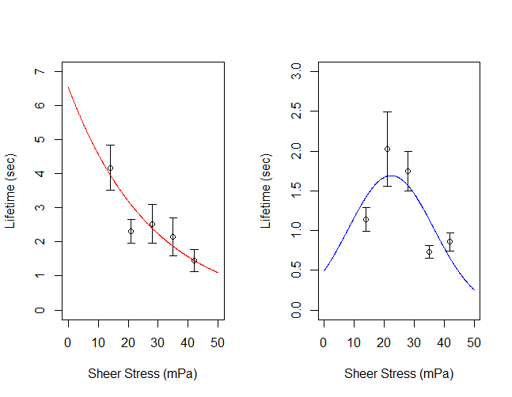
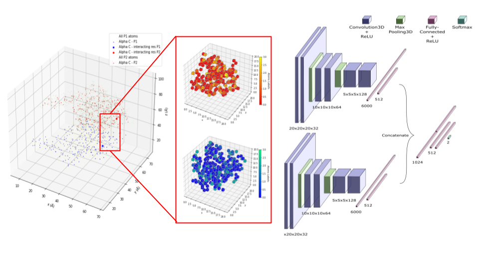

# Biophysics-With-Code

Welcome to Biophysics with Code!

## Project 1: Quorum Sensing in _V. Fischeri_

**Citation for originial paper**: James, S., Nilsson, P., James, G., Kjelleberg, S. & Fagerström, T. (2000) 'Luminescence control in the marine bacterium _Vibrio Fischeri_: an analysis of the dynamics of lux regulation', _Journal of Molecular Biology_, 296(4), Pages 1127-1137 [doi:10.1006/jmbi.1999.3484](https://pubmed.ncbi.nlm.nih.gov/10686109/).

**Brief Summary**: Quorum sensing (QS) is a cell-cell bacterial communication mechanism that allows the bacterial species to cooperatively regulate specific gene expressions in response to changes in their local population density. The term 'quorum' in QS is used in its most literal sense to denote the fact that the gene expression in a bacterial population is strongly induced only when the 'quorum' threshold requirement is met. In this paper, James et al have attempted to model the phenotypic on-off switch of bioluminescence in _V. fischeri_ using a general chemical kinetics approach of lux regulatory system that controls the production of light in the bacteria. A key finding of the research is that, even though the overall mechanism of cell-cell communication in _Vibrio Fischeri_ is through the QS, there exists a certain range of conditions, where a single free marine bacterial cell can also luminesce light.

**Programming Language**: Wolfram Mathematica 

**Report**: Available 

**Highlights**: 

 

The top figure above shows the key principles behind QS mechanism in _Vibrio Fischeri_ [(source)](http://photobiology.info/Lin.html). The bottom figure shows the switch-like behavior of the gene to induce photoluminiscence depending upon values of the system variables defined in the original paper. Shading scale is shown as a legend, where the numbers correspond the time it takes for the system to asymptotically reach either of the two stable steady states - on and off.  

## Project 2: Force-Dependent Adhesion of Malaria-Infected Red Blood Cells with ICAM-1 and CD36

**Citation for originial paper**: Lim Y. B., Thingna J., Cao J. & Lim C. T. (2017), 'Single molecule and multiple bond characterization of catch bond associated cytoadhesion in malaria' _Scientic Reports_ 7(1).
[doi:10.1038/s41598-017-04352-x](https://www.nature.com/articles/s41598-017-04352-x)

**Brief Summary**: Patients of malaria show abnormally high levels of infected red blood cell (iRBC) adhesion to the membrane proteins expressed in the endothelial vessels. This is one of the main causes that lead to severe disease pathology in malarial patients like multiple organ failure and cerebral malaria. In this study, the authors have taken a biophysical approach to study the interactions between iRBCs and specific endothelial receptor proteins - CD36 and ICAM-1. The method described in this paper is very elegant as it is used to simultaneously study protein-ligand adhesive interactions at single-molecule and single-cell scale. The highlight of this study is the result that even though the dissociation rates of ICAM-1 and CD-36 are similar to each other in magnitude, the catch-bond like behavior and a high re-association rates of ICAM-1 make its adhesion to iRBCs much more significant. 

**Programming Language**: R (compiled and verified in RStudio)

**Report**: Available 

**Highlights**: 

 
 

The figure above shows the bond lifetimes of the two endothelial proteins to iRBC cells - CD36 (left) which shows a slip-like behavior and ICAM-1 (right) which shows a catch-like behavior at single molecule protein-ligand interaction. According to the figure result above, both theory and experiments suggest that even in multiple bond case, the behavior remains the same - which is an impressive finding! 

**Additional note**: For this parameter-fit analysis, you will need to have access to the experimental data. I was able to obtain the data by contacting the corresponding author as mentioned on the publication. If you would like to follow through the parameter-fit analysis, I would recommend emailing the corresponding author directly.

## Project 4: Predicting Protein-Protein Interface Using 3D-CNN - Solving a Flexible 3D Jigzaw Puzzle

**Citation for originial paper**: Townshend R. J. L., Bedi R., Suriana P. A., Dror R. O. (2018), 'End-to-End Learning on 3D Protein Structure for Interface Prediction
' _arXiv_. [1807.01297] (https://arxiv.org/abs/1807.01297)

**Brief Summary**: 
- Goal: Given separate structures of two proteins, Want to predict which surfaces of the two proteins will come into contact upon binding; 
- Workflow: Using PDB files of paired protein structures, train an ML model on atomic coordinates, transformed into 3D images, to make interface predictions;
- Novelty: Only uses spatial coordinates and identities of atoms as inputs, instead of relying on hand-crafted features;
- Motivation: Potential applications in protein engineering and drug development.

**Programming Language**: Python (built and tested with Tensorflow 2.3.0)

**Report**: Available 

**Highlights**: 

 

The model has a Siamese-like architecture (which is generally used to do comparison tasks like facial recognition) to train on identifying if two 3d pieces of different protein structures have affinity towards one another by combining their structural and atomic interactions. The model uses two different datasets that have both individual and co-crystal structures for training (DIPS) and testing (DB5). While the original authors claim that their trained model outperforms all other methods by giving a testing accuracy of 86%, in this reproduction I have found the accuracy to be 76% on DB5. The discrepancy can be a result of differences in implementation, computational resources, or sheer randomness. 

**Additional Note**: Labeled training and testing data are available as tfrecord files through this [link] (https://dataverse.harvard.edu/dataset.xhtml?persistentId=doi:10.7910/DVN/H93ZKK)

## Project 4: Effect of Environmental Conditions on Basic Reproduction Number of a Seasonal Hospital-Acquired Infection

**Citation for originial paper**: Huang Q., Huo X., Miller D., & Ruan S. (2019), 'Modeling the seasonality of Methicillin-resistant Staphylococcus aureus infections in hospitals with environmental contamination' _Journal of Biological Dynamics_, 13:sup1, 99-122. [doi.org/10.1080/17513758.2018.1510049]  (https://doi.org/10.1080/17513758.2018.1510049)

**Brief Summary**: MRSA is one of the most common causes of hospital-acquired infections, often acquired following a surgical or invasive medical procedure during a hospital stay. It is usually treadted with antibiotics, however, as antibiotics are abused to be prescribed to inhibit these kinds of bacteria infections, MRSA has become resistant to many common antibiotics. Furthermore, seasonal variation of MRSA infections in the hospital settings has been widely observed. Combining these two conditions - antibiotic prescription (and resistence) and seasonal variation of the infection, this paper models the evolution of the infection in a hospital setting. Using sensitivity analysis of R0, this study finds that environmental cleaning is the most important intervention to control the infection.

**Programming Language**: Mathematica

**Report**: Not Available

**Highlights**: 

The first image above shows the periodicity observed in the prescription of antibiotic drugs, which makes it essential to redefine the mathematical analysis of basic reproduction number, R0. The highlight of this paper for me is finding and verifying the mathematical and physical basis of R0 with periodic inputs. The model is then used to run numerical simulations to observe how sensitive is R0 to each of the model parameters. The study finds that increasing the environmental cleaning/disinfection rate (γb) from 0.6 to 1 reduces the basic reproduction number from 1.705 to 1.065, hence making environmental cleaning most important intervention to control the infection 

