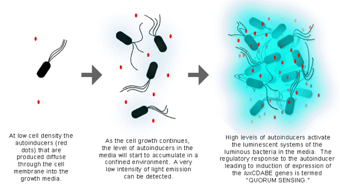
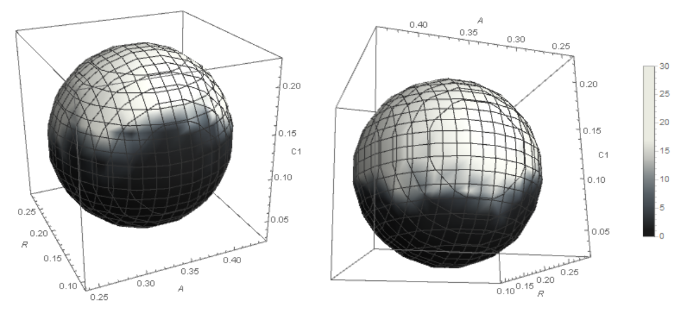

# Biophysics-With-Code

Welcome to Biophysics with Code!

## Project 1: Quorum Sensing in _V. Fischeri_

**Citation for originial paper**: James, S., Nilsson, P., James, G., Kjelleberg, S. & Fagerström, T. (2000) 'Luminescence control in the marine bacterium _Vibrio Fischeri_: an analysis of the dynamics of lux regulation', _Journal of Molecular Biology_, 296(4), Pages 1127-1137 [doi:10.1006/jmbi.1999.3484](https://pubmed.ncbi.nlm.nih.gov/10686109/).

**Brief Summary**: Quorum sensing (QS) is a cell-cell bacterial communication mechanism that allows the bacterial species to cooperatively regulate specific gene expressions in response to changes in their local population density. The term 'quorum' in QS is used in its most literal sense to denote the fact that the gene expression in a bacterial population is strongly induced only when the 'quorum' threshold requirement is met. In this paper, James et al have attempted to model the phenotypic on-off switch of bioluminescence in _V. fischeri_ using a general chemical kinetics approach of lux regulatory system that controls the production of light in the bacteria. A key finding of the research is that, even though the overall mechanism of cell-cell communication in _Vibrio Fischeri_ is through the QS, there exists a certain range of conditions, where a single free marine bacterial cell can also luminesce light.

**Programming Language**: Wolfram Mathematica 

**Report**: Available 

**Highlights**: 

 

The top figure above shows the key principles behind QS mechanism in _Vibrio Fischeri_ [source](http://photobiology.info/Lin.html). The bottom figure shows the switch-like behavior of the gene to induce photoluminiscence depending upon values of the system variables defined in the original paper. Shading scale is shown as a legend, where the numbers correspond the time it takes for the system to asymptotically reach either of the two stable steady states - on and off.  

